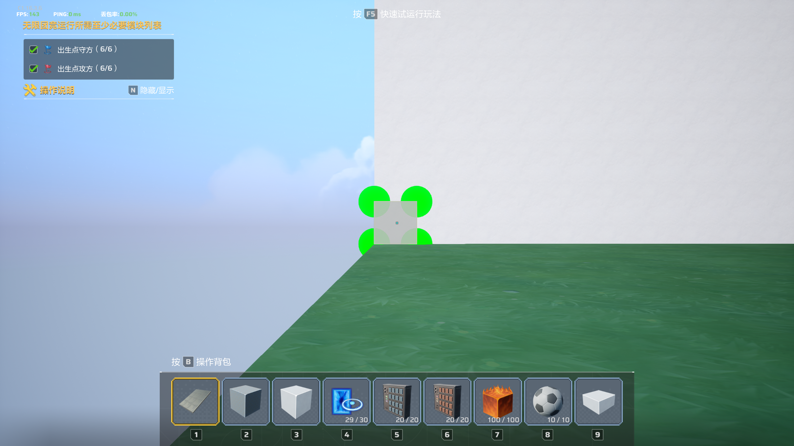
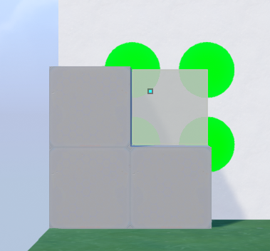

## 卡丘工坊自动像素画


#### 从源码构建

```
pip install -r requirements_vision.txt
python .\run_app.py
```


#### 使用说明

1. 导入一张图像，选择需要的宽和高，生成蓝图

2. ~~按照软件提示（未实现）~~，将1号快捷栏设置为铁板，2号快捷栏设置为染色方块

3. 移动到画布（空白画布工坊代码 vuuwr9）的左下角，距离画布10格左右（绿色圆点半径在100-200之间，放置方块后刚好能不漏出缝隙为最佳），调整视角尽可能平视前方（有自动纠错，但不水平会增加失误率）

   

   

4. 确保染色面板键位是E，Space上升，Alt下降，WASD是前后左右

5. 确保 调试 界面显示的目标窗口是卡拉彼丘，如果不是，点击“一键选中卡拉彼丘”

6. 在 任务 界面点击开始搭建，然后在3秒内手动切换到卡拉彼丘界面


#### TODO:

1. 蓝图生成优化：提取线稿（轮廓）功能，更好的缩放/取色算法
2. 方块匹配：录入更多的方块底色，构建一个自由选择2-8号快捷栏放什么方块的菜单界面
3. 撞墙识别
4. UI校准
5. 自定义蓝图建造顺序：当前是S形建造，即最底一行向右，然后第二行向左等等，加入按区块建造以方便检查
6. 用户配置数据，蓝图数据和任务中断数据需要持久化到本地
7. 长时间运行时的内存泄漏问题
